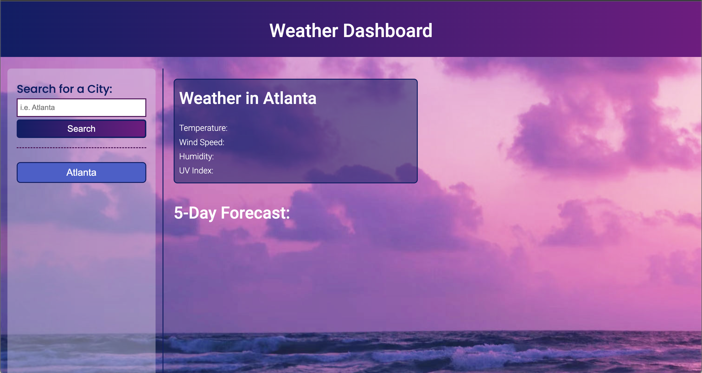
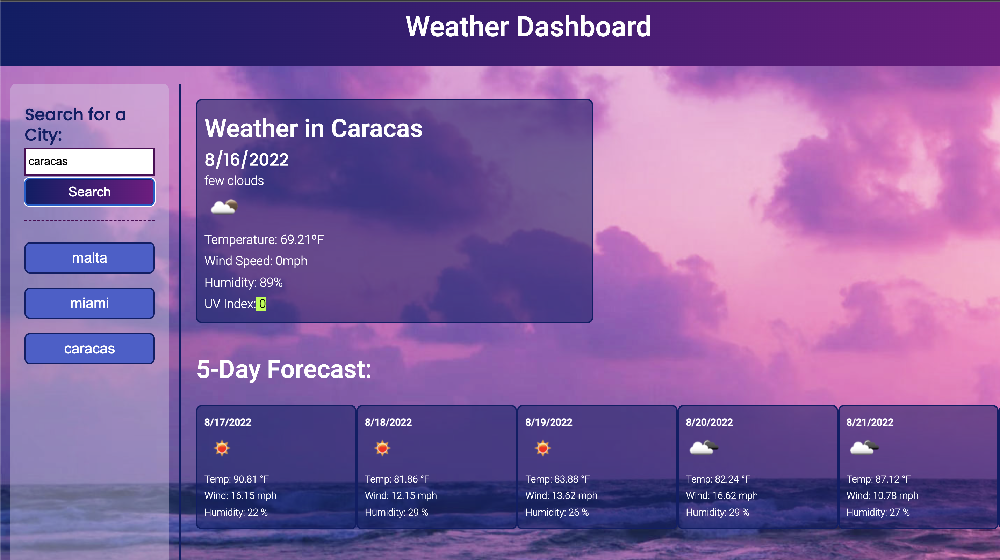

# Weather Dashboard

## URL to launch website

**Please use the following link to view the website: [Weather Dashboard](https://yuyitax.github.io/06-weather-api/)

-------------

## About this project

This weather dashboard allows users to search for the weather in any city in the world. The weather dashboard will show the temperature, wind speed, humidity and UV Index of the chosen city, as well as an icon and a description of what it represents.

Users will also be able to see a 5 day forecast for that city showing the same parameters mentioned above. 

Another functionality in this weather dashboard is that users will have a search history on the left side attached to their local storage.

-------------

## Screenshots

The following image shows the web application's appearance and functionality:

- - -
© 2022 Cristina Yunes -- Yuyitax. All Rights Reserved.
